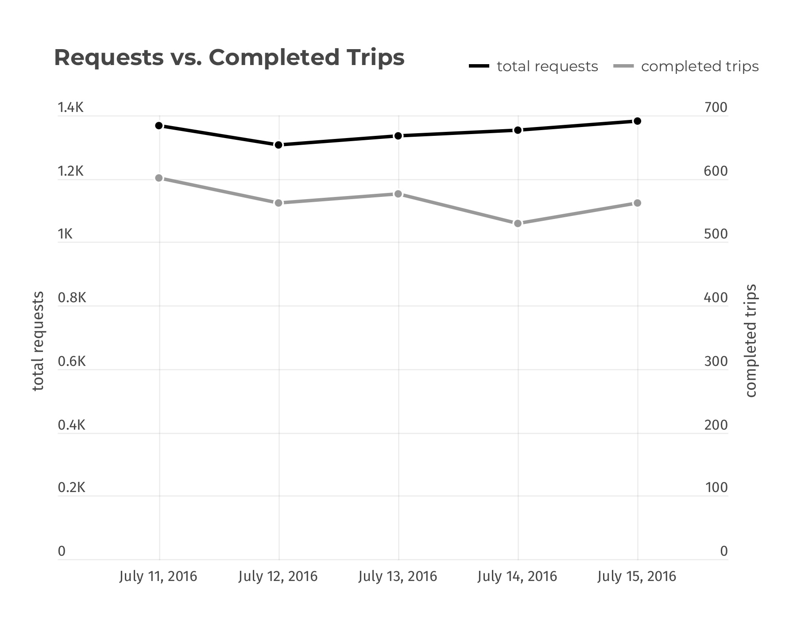
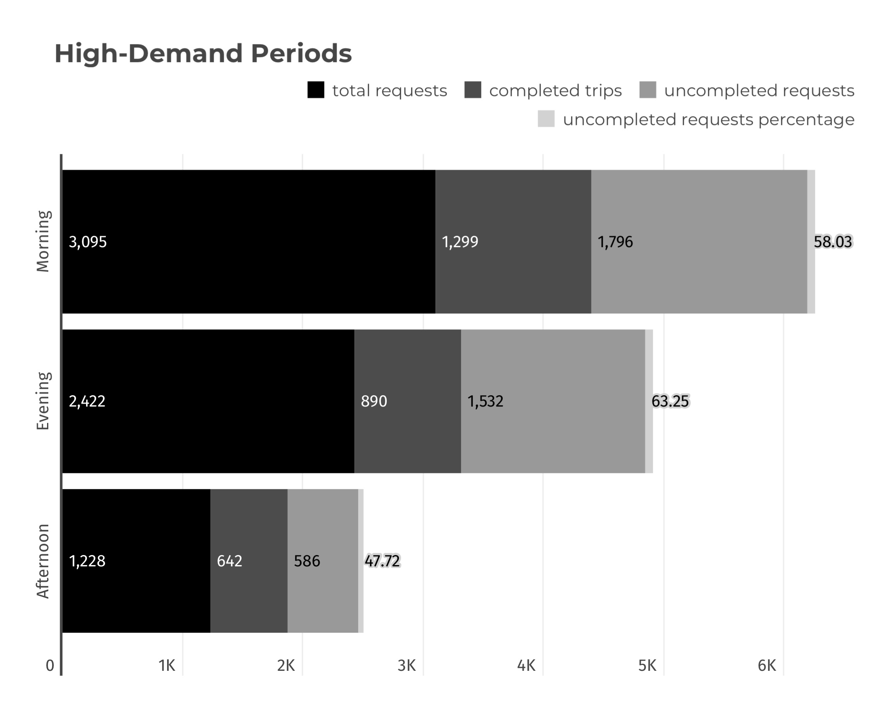
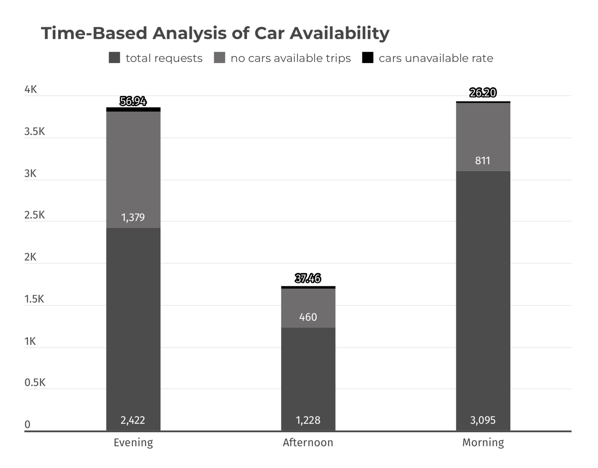
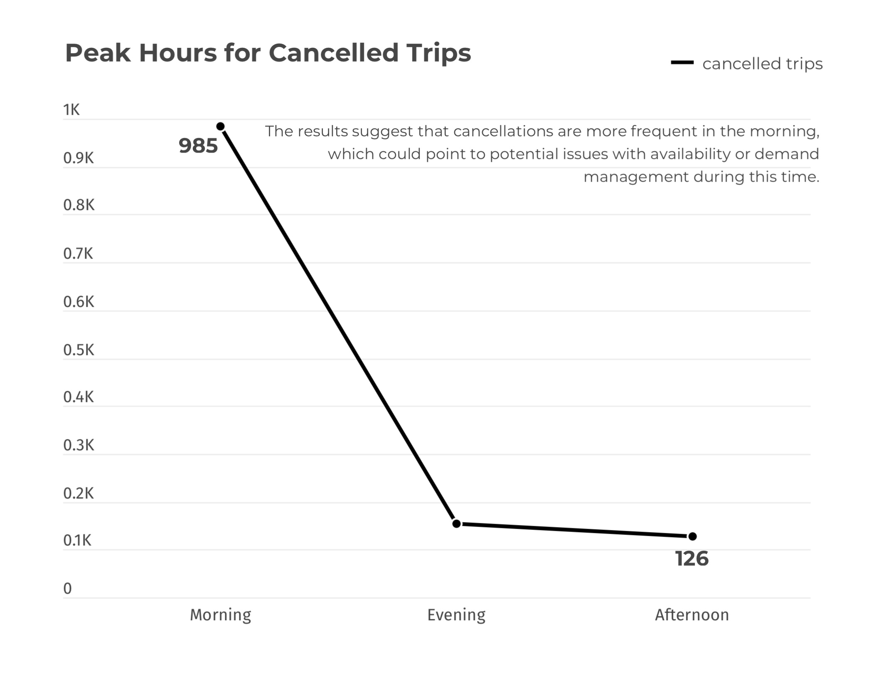
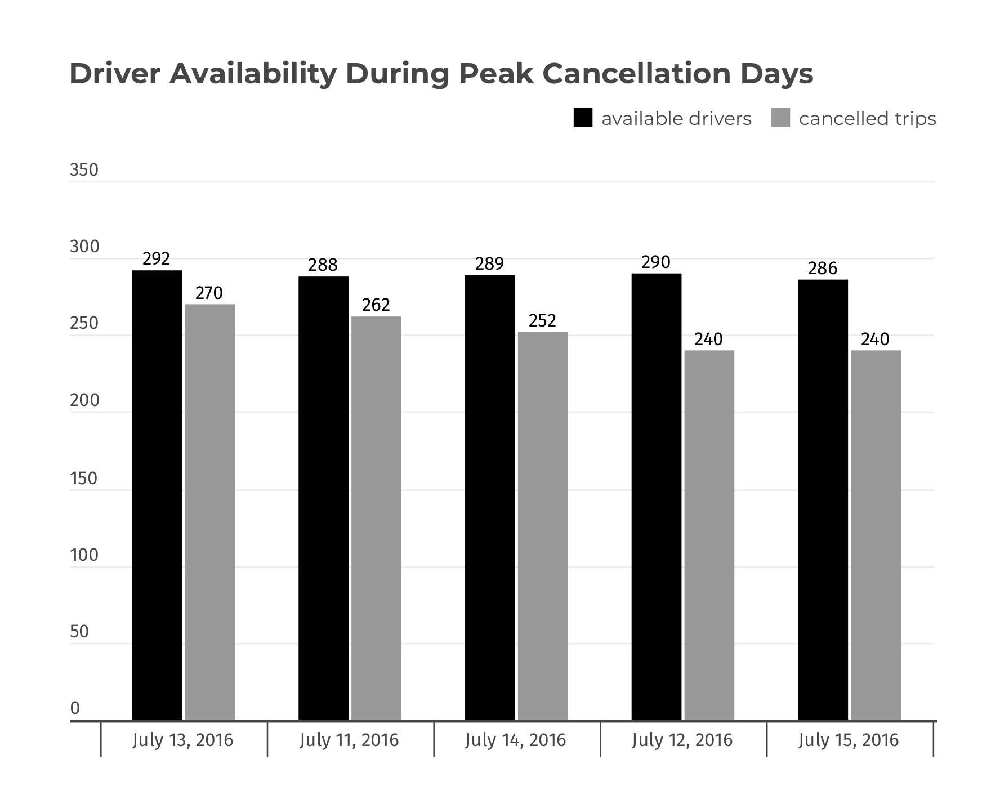

# Introduction
## Project Overview: 
This project aims to analyze Uber trip data to identify key patterns and trends that can inform data-driven decision-making. The primary focus is on understanding demand fluctuations, driver performance, and operational efficiency. By examining various factors such as peak hours, trip completion rates, and supply-demand mismatches, this analysis seeks to provide actionable insights that can enhance service delivery and optimize resource allocation.

The dataset used in this analysis is sourced from [here](https://www.kaggle.com/datasets/hellbuoy/uber-supplydemand-gap).

# Background

# Analysis & Findings
## 1. Demand Analysis 
### Objective:
To analyze trip request patterns by time of day and pickup location to optimize driver allocation and improve service efficiency.
### Question: 
During which hours and at which pickup points do trip requests peak, and how can this data inform strategic decisions on driver deployment?

### 1.1 Peak Hours Analysis
To meet the objective of identifying when trip requests peak, I began by analyzing the hourly distribution of trip requests. This analysis focuses on extracting the hour from the "Request timestamp" and counting the number of requests for each hour. By grouping the data by hour, I can identify specific times of the day when the demand for trips is highest.
```sql
SELECT 
    EXTRACT(HOUR FROM "Request timestamp") AS hour_of_day,
    COUNT(*) AS number_of_requests
FROM 
    uber_request_data
GROUP BY 
    EXTRACT(HOUR FROM "Request timestamp")
ORDER BY 
    hour_of_day;
```

**Findings:** The data shows that the number of requests increases significantly during specific hours of the day (Figure 1).  
Notably:  
Morning Peak: Between 7 AM and 9 AM, the number of requests rises steadily, peaking at 431 requests at 9 AM.  
Evening Peak: From 5 PM to 8 PM, there is another significant rise in requests, with the highest number of 510 requests occurring at 6 PM.  
**Interpretation:** These peaks correspond to common commuting hours, suggesting that Uber experiences the highest demand when people are traveling to and from work. This insight implies that these time periods are critical for ensuring an adequate supply of drivers to meet the high demand.

*Figure 1. The line chart visualizes the hourly distribution of Uber ride requests*

### 1.2 Pickup Point Analysis
To pinpoint the locations with the most requests, I conducted a Pickup Point Analysis. The detailed findings can be accessed here: [Open SQL Query](uber_request/1_demand_analysis.sql).

**Findings:** The distribution of requests between pickup points is relatively balanced, with the City having slightly more requests (3,507) compared to the Airport (3,238).  
**Interpretation:** Both the City and Airport are major hubs for Uber requests, but the slightly higher demand in the City suggests that it is a key area for Uber's operations. 


##  2. Driver Performance 
### Objective:
To evaluate driver performance by understanding the efficiency and productivity of each driver.
### Question: 
What is the average duration of trips for each driver? 
How many trips does each driver complete in a given time period?

### 2.1 The average trip duration per driver
To achieve the objective of evaluating driver performance, the query below calculates the average duration of completed trips for each driver.
### Data Overview:
**Average Trip Duration (Minutes)**: This metric reflects how long, on average, a trip takes for each driver.  
**Number of Trips**: This represents the total number of trips completed by each driver.

```sql
SELECT 
    "Driver id",
	Round(AVG(EXTRACT(EPOCH FROM ("Drop timestamp" - "Request timestamp")) / 60), 2) 
	AS average_trip_duration_minutes
FROM 
    uber_request_data
WHERE 
    "Status" = 'Trip Completed'
GROUP BY 
    "Driver id"
ORDER BY 
    average_trip_duration_minutes DESC;
```

**Interpretation of the result:**  
*Efficiency (Average Trip Duration)*: Drivers with lower average trip durations may be more efficient, as they complete trips faster. However, very short durations might indicate shorter distances or simpler routes rather than higher efficiency. The top-performing drivers in terms of efficiency have average trip durations ranging from approximately 45 to 66 minutes.  

### 2.2 Number of Trips per Driver
To determine the number of trips per driver, the following query was executed.
```sql
SELECT 
    "Driver id",
    COUNT(*) AS number_of_trips
FROM 
    uber_request_data
WHERE 
    "Status" = 'Trip Completed'
GROUP BY 
    "Driver id"
ORDER BY 
    number_of_trips DESC;
```

**Productivity (Number of Trips)**: A higher number of trips indicates higher productivity. Drivers who complete more trips are generally more productive. Productivity varies significantly among drivers, with some completing as many as 16 trips, while others complete only 4.

**Insights:**  
*High Efficiency, Low Productivity:* Drivers who have low average trip durations but fewer trips might be taking shorter routes or working fewer hours.
Example: Driver ID 84 has one of the highest average trip durations (65.58 minutes) but could also be balanced by a high number of trips, making them efficient and productive.  
*High Productivity, Moderate Efficiency:* Drivers who complete a high number of trips but have moderate average durations might be consistently working longer hours.
Example: Driver ID 22 has a relatively high number of trips (16) with an average trip duration that is balanced for both efficiency and productivity.  
*Balanced Efficiency and Productivity:* Drivers who manage to maintain a balance between average trip duration and the number of trips can be considered both efficient and productive. Example: Driver ID 125, with 14 trips and an average trip duration of around 50.15 minutes, appears to maintain a good balance.

**Recommendations:** Further Analysis: Segment drivers by regions or shifts to see if specific patterns contribute to their performance differences.


## 3. Supply-Demand Mismatch
### Objective:  
To identify periods when the number of requests exceeds the number of completed trips, indicating potential supply shortages.  
### Questions: 
Supply vs. Demand: Are there periods when the number of trip requests exceeds the number of trips completed? What are the times or dates when supply might not meet demand?

### 3.1 Requests vs. Completed Trips
To achieve the objective, I began by analyzing the relationship between requests and completed trips using the following query: [Open SQL Query](uber_request/3_supply_demand.sql).

**Interpretation of the result:**  The total number of requests increases steadily from July 11 to July 15, with the highest number of requests (1381) on July 15, indicating peak demand as displayed in Figure 2. The completion rate drops from 43.96% on July 11 to 39.17% on July 14, then slightly rises to 40.62% on July 15. This shows a growing mismatch between demand and supply, as fewer trips are completed compared to the number of requests. 


### 3.2 Identifying the High-Demand Periods
To assess supply and demand, high-demand periods were identified using the following query:
```sql
WITH request_summary AS (
    SELECT
        CASE
            WHEN EXTRACT(HOUR FROM "Request timestamp") BETWEEN 0 AND 11 THEN 'Morning'
            WHEN EXTRACT(HOUR FROM "Request timestamp") BETWEEN 12 AND 17 THEN 'Afternoon'
            ELSE 'Evening'
        END AS time_phase,
        COUNT(*) AS total_requests,
        COUNT(CASE WHEN "Status" = 'Trip Completed' THEN 1 END) AS completed_trips
    FROM
        uber_request_data
    GROUP BY
        time_phase
)
SELECT
    time_phase,
    total_requests,
    completed_trips,
    total_requests - completed_trips AS uncompleted_requests,
    ROUND((total_requests - completed_trips) * 100.0 / total_requests, 2) AS uncompleted_requests_percentage
FROM
    request_summary
WHERE
    total_requests > completed_trips
ORDER BY
    uncompleted_requests DESC;
```

**Interpretation of the result:** The evening period shows the highest demand with 63.25% of requests going uncompleted, indicating a significant supply-demand mismatch in Figure 3. The morning also experiences high demand with 58.03% uncompleted requests, while the afternoon, though less severe, still has a notable 47.72%. These insights suggest a need to better align driver availability with peak demand times to reduce uncompleted requests.


### 3.3 Time-Based Analysis of Car Availability
Time-Based Analysis of Car Availability was conducted through this query:[Open SQL Query](uber_request/3_supply_demand.sql). 

**Interpretation of the result:** The analysis shows that the evening period has the highest rate of no cars available at 56.94%, compared to 37.46% in the afternoon and 26.20% in the morning. This suggests that car shortages are most severe in the evening, reflecting the peak demand times. Improving car availability during the evening could help address these shortages and enhance service levels.


### 3.4 Identifying Peak Hours for Cancelled Trips
To better understand the supply versus demand, the analysis on Cancelled Trips was conducted to identify peak hours for canceled trips. The detailed query can be accessed here: [Open SQL Query](uber_request/3_supply_demand.sql). 


### 3.5 Driver Availability During Peak Cancellation Hours 

To understand the causes of trip cancellations, the Driver Availability query was used to analyze driver availability during peak cancellation hours.The detailed query can be accessed here: [Open SQL Query](uber_request/3_supply_demand.sql). 
**Insights:** The number of drivers available is relatively stable across the days, ranging from 286 to 292. This suggests that having more drivers does not fully address the issue of trip cancellations, indicating that other factors might be influencing the cancellation rate.

**Recommendations:** Investigate External Factors: Explore if there are external factors influencing cancellations, such as local events, weather conditions, or changes in demand patterns, and adjust operational strategies accordingly.


