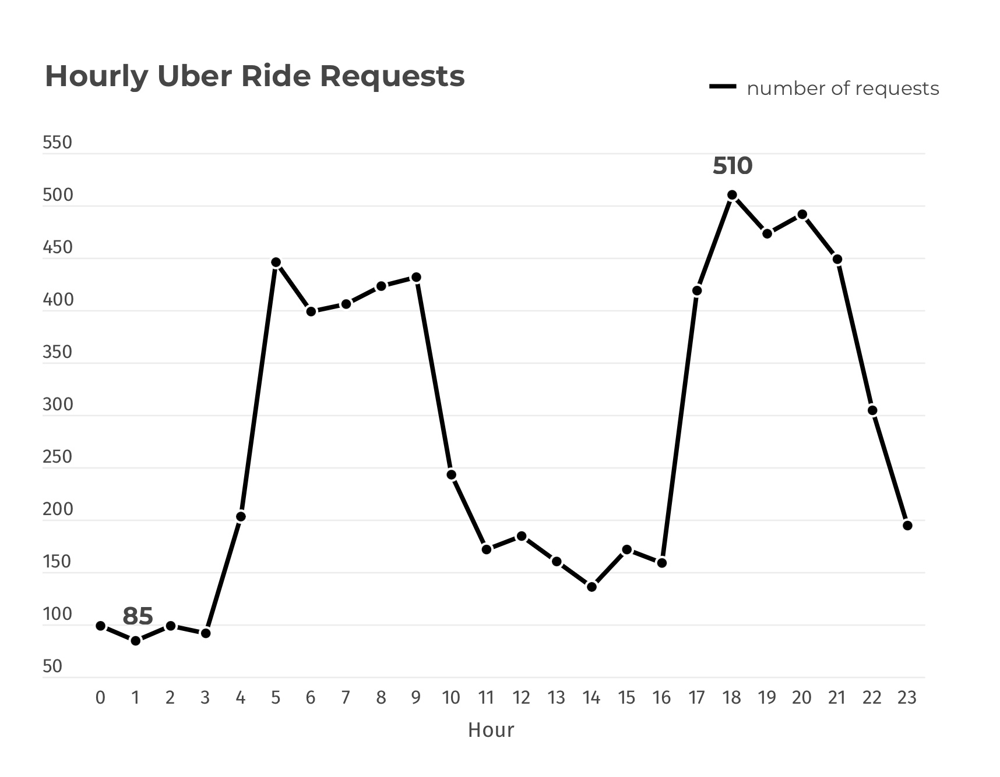

# Introduction
## Project Overview: 
This project aims to analyze Uber trip data to identify key patterns and trends that can inform data-driven decision-making. The primary focus is on understanding demand fluctuations, driver performance, and operational efficiency. By examining various factors such as peak hours, trip completion rates, and supply-demand mismatches, this analysis seeks to provide actionable insights that can enhance service delivery and optimize resource allocation.

The dataset used in this analysis is sourced from [here](https://www.kaggle.com/datasets/hellbuoy/uber-supplydemand-gap).

# Background

# Analysis & Findings
## 1. Demand Analysis 
### Objective:
To analyze trip request patterns by time of day and pickup location to optimize driver allocation and improve service efficiency.
### Question: 
During which hours and at which pickup points do trip requests peak, and how can this data inform strategic decisions on driver deployment?

### Peak Hours Analysis
To meet the objective of identifying when trip requests peak, I began by analyzing the hourly distribution of trip requests. This analysis focuses on extracting the hour from the "Request timestamp" and counting the number of requests for each hour. By grouping the data by hour, I can identify specific times of the day when the demand for trips is highest.
```sql
SELECT 
    EXTRACT(HOUR FROM "Request timestamp") AS hour_of_day,
    COUNT(*) AS number_of_requests
FROM 
    uber_request_data
GROUP BY 
    EXTRACT(HOUR FROM "Request timestamp")
ORDER BY 
    hour_of_day;
```

**Findings:** The data shows that the number of requests increases significantly during specific hours of the day (Figure 1).  
Notably:  
Morning Peak: Between 7 AM and 9 AM, the number of requests rises steadily, peaking at 431 requests at 9 AM.  
Evening Peak: From 5 PM to 8 PM, there is another significant rise in requests, with the highest number of 510 requests occurring at 6 PM.  
**Interpretation:** These peaks correspond to common commuting hours, suggesting that Uber experiences the highest demand when people are traveling to and from work. This insight implies that these time periods are critical for ensuring an adequate supply of drivers to meet the high demand.

*Figure 1. The line chart visualizes the hourly distribution of Uber ride requests*


[Link Text](uber_request/1_demand_analysis.sql)


